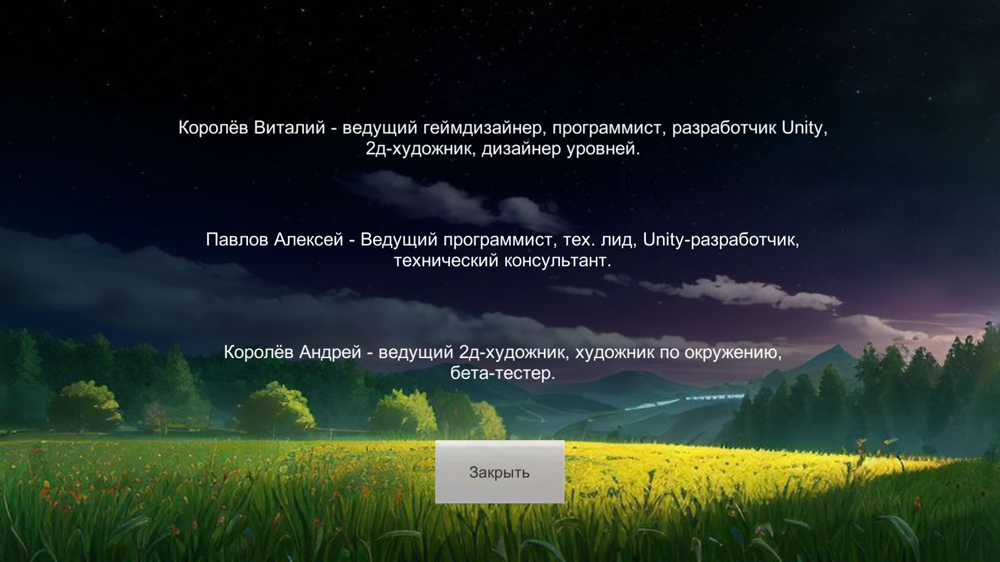
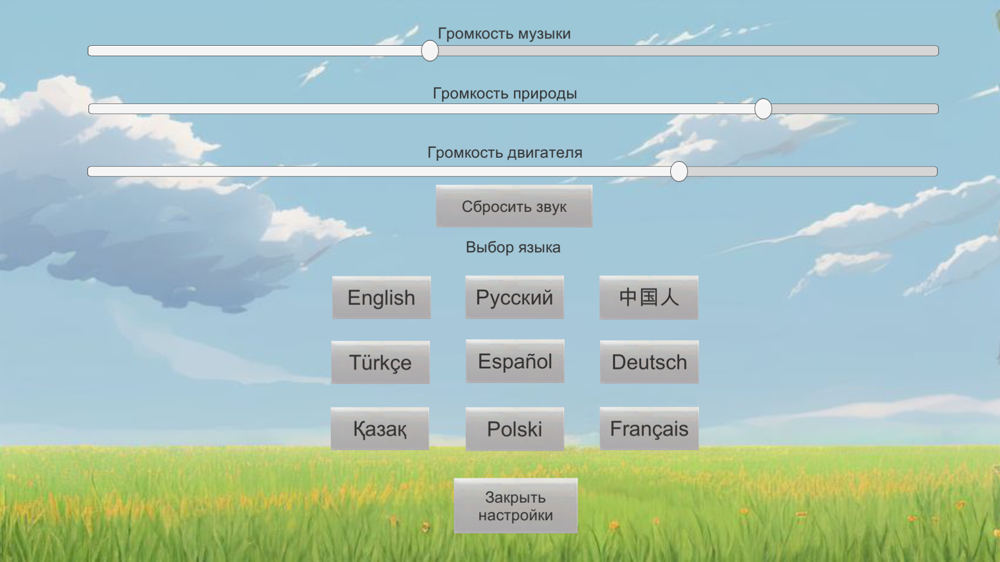
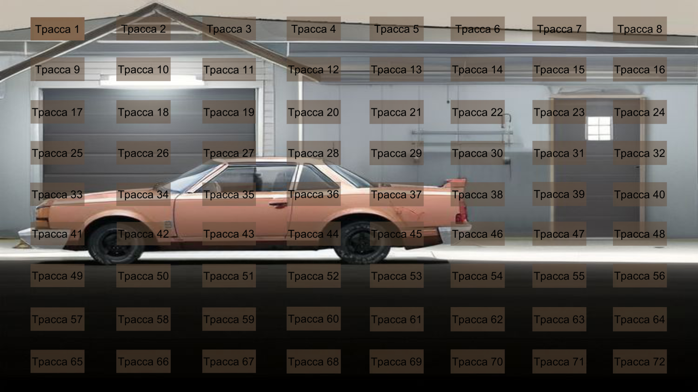
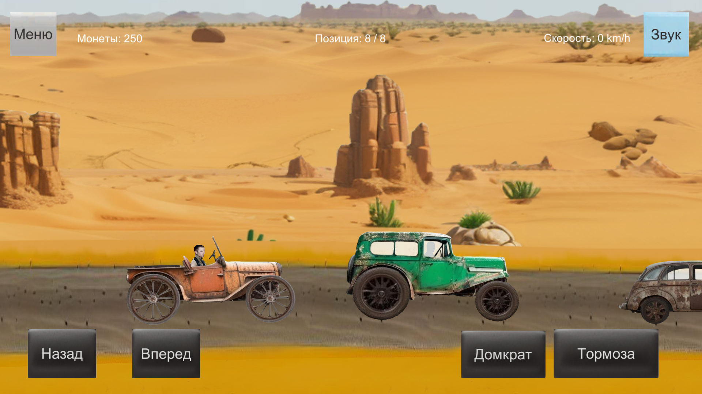
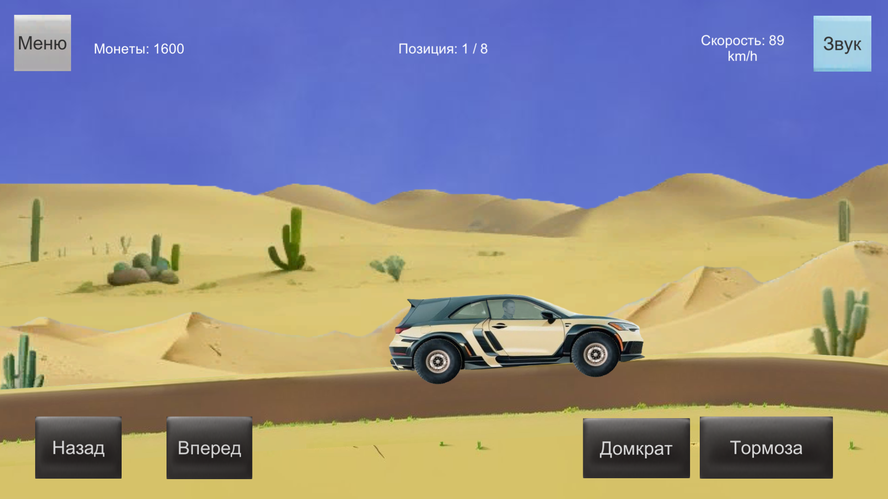
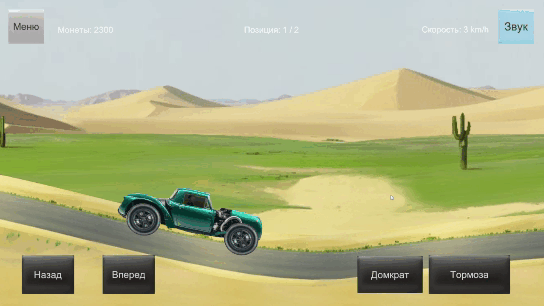

# CarRacing
Игра представляет собой 2д гонки рассчитанные на дальнейшую загрузку в Яндекс игры. Цель игры проходить разные трассы постепенно перебираясь из одного биома в другой. Каждые несколько уровней гонка с боссом как провека навыка и прокачки автомобиля. В этой демо 5 локаций и 1 бос.
Это проект моего знакомого в котором я принимаю активное участие, но помогаю в построении архитектуры и исправлении ошибок. Так же помогаю советом о том как реализовать ту или иную механику. 

Представить код не могу, так как проект не мой и все скрипты не являются моей интеллектуальной собственностью.

# Геймплей
- В игре реализованы разные награды за финиширование с 1 по 4 место. Это значени увеличивается на каждой новой трассе.
- По мимо игрока на трассе есть еще и другие гонщики под уравлением ИИ.
- На локации с боссом, есть только игрок, босс и полицейская машина.
- Есть полицейская машина, что при остановке арестовывает и необходимо пройти заезд заново.
- Машины можно покупать за игровую валюту зарабатываемую в заездах. Машины расположены от самых обычных до гоночных версий.
- Валюту так же можно получить за просмотр рекламы, в демо реклама убрана и можно так делать деньги для тестирования разных машин и их прокачки.
- У каждой машины можно улучшить скорость, ускорение и торможение на 5 ступеней.
- Есть смена языка.
- Настройка громкости звуков и музыки.
- Сохранение настроек и информации об игроке реализовано через Player prefs.
- Управление расчитано как для мобильных устройтв так и для ПК. 

# Запуск проекта
- В папке Build есть скомпилированная версия мобильного приложения пригодная для тестирования в подпапке apk, а так же компьютерный файл .exe в подпапке windows

# Скриншоты и геймплей
 
 

 
 

 

